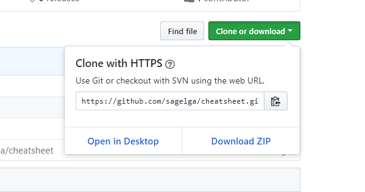
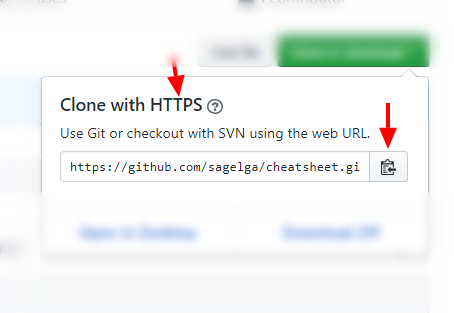

# Clone Repo
using `git clone`

หากว่าน้องๆ มี repository อยู่แล้วใน GitHub น้องๆก็สามารถทำการ copy และตั้งค่าพิ้นฐานให้กับตัว repo ได้ โดยการ

1. เข้าไปที่ repo ที่ต้องการ clone


2. กดปุ่ม 'Clone or Download'


3. Copy ตัว URL มาโดยการกดปุ่ม copy (ลูกศรขวา)<br>
โดยในขณะนี้ น้องๆ สามารถทำการ Clone ด้วยวิธี HTTPS ได้ครับ<br>
แต่หากน้องๆ ทำการ [สร้าง และให้ข้อมูล Public Key SSH Key กับ Github](https://help.github.com/articles/connecting-to-github-with-ssh/) แล้ว ก็สามารถทำการเลือกรูปแบบการ clone แบบ SSH ได้



4. น้องๆ ก็ใช้ Command Line และเข้าไปใน Directory ที่น้องต้องการเอาไปแปะไว้<br>
และทำการใช้คำสั่ง
```
git clone <URL>
```

โดยการเอา URL ที่น้องได้ทำการ copy ไว้จากขั้นตอนที่แล้วมาแปะไว้ที่จุด `<URL>` ตัวอย่างเช่น
```
git clone https://github.com/sagelga/cheatsheet.git
```

และน้องๆ ก็จะมี repo ที่มาจากตัว GitHub แล้วครับ

---

### Reference
- [https://help.github.com/articles/cloning-a-repository/](https://help.github.com/articles/cloning-a-repository/)
- [https://confluence.atlassian.com/bitbucket/clone-a-repository-223217891.html](https://confluence.atlassian.com/bitbucket/clone-a-repository-223217891.html)